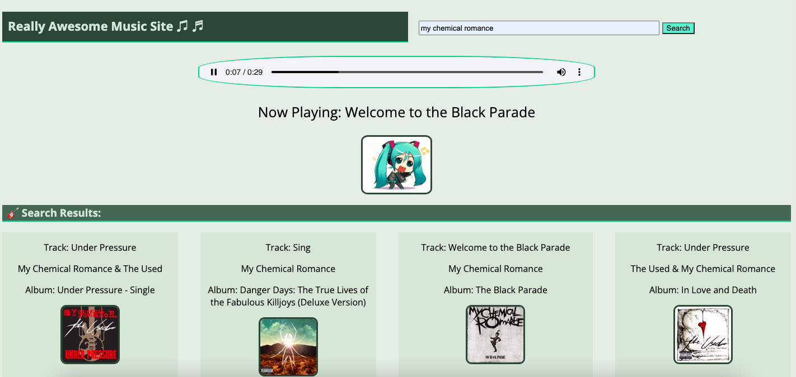

# MyTunes App

App that requests data from the iTunes API.

- A user can search for songs by artist or band name.
- Validates the input so that a search request is not sent with no search term.
- Display the search results without reloading the page.
- The results should include song details like artist name, album title, album image, and release date.
- Users can click on a song title to play a song preview.
